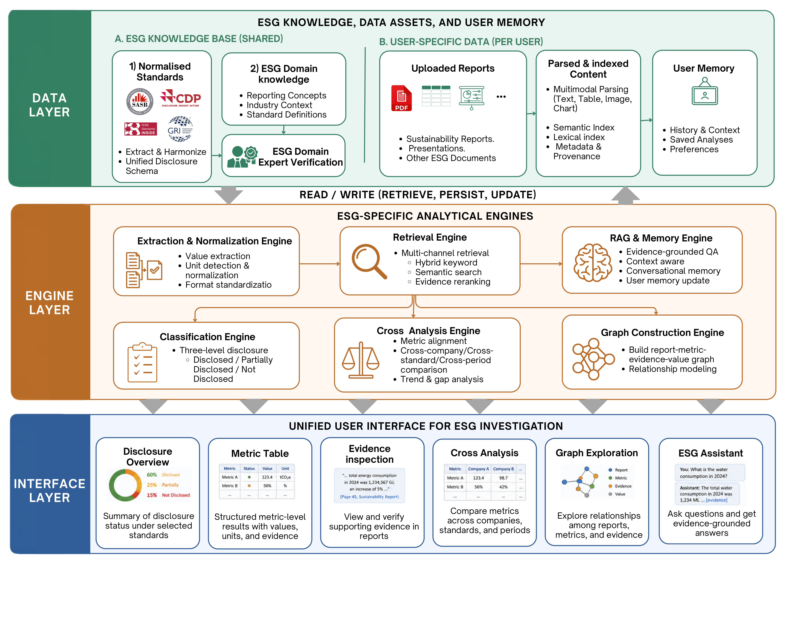

# EulerESG

EulerESG is an evidence-grounded ESG disclosure analysis system. It routes each PDF page between native-text extraction and PaddleOCR-VL multimodal parsing based on page quality, then combines local vector retrieval, keyword retrieval, Qwen3 Reranker, and a remote LLM to produce metric-level disclosure status, values, units, years, page numbers, and evidence provenance.

The repository supports single-report analysis, aggregated analysis across multiple reports from the same company, cross-report comparison, disclosure graphs, standards browsing, and report-grounded question answering.

## System Architecture



The architecture in the diagram maps to the current code as follows:

| Layer or engine | Current implementation | Main code |
| --- | --- | --- |
| Data layer | SASB, GRI, and CDP metric libraries; SASB retrieval profiles; uploaded PDFs; parsed segments; embeddings; file and company metadata; chat history | [`backend/data`](backend/data), [`file_manager.py`](backend/src/esg_encoding/file_manager.py), [`company_registry.py`](backend/src/esg_encoding/company_registry.py) |
| Extraction and normalization | Lossless PDF splitting, PaddleOCR-VL multimodal parsing, table repair, unit and value candidates, and internal PDF link attachment | [`content_extractor.py`](backend/src/esg_encoding/content_extractor.py), [`backend/paddleocr_vl`](backend/paddleocr_vl) |
| Retrieval engine | Code, alias, BM25, vector, HippoRAG, and internal-link candidate fusion; evidence qualification; dynamic TopK; Qwen3 Reranker | [`retrieval`](backend/src/esg_encoding/retrieval), [`dual_channel.py`](backend/src/esg_encoding/retrieval/dual_channel.py) |
| Classification and value resolution | Deterministic direct-disclosure rules, shared-Code disambiguation, annual value extraction, evidence chunking, and three-level disclosure classification | [`disclosure_inference.py`](backend/src/esg_encoding/disclosure_inference.py) |
| Cross-report analysis | Metric alignment, report/company/year comparisons, and disclosure-record aggregation | [`cross_analysis.py`](backend/src/esg_encoding/cross_analysis.py), [`cross_analysis_service.py`](backend/src/esg_encoding/services/cross_analysis_service.py) |
| Graph engine | Deterministic projection of reports, metrics, disclosures, and evidence with neighborhood expansion | [`disclosure_graph_service.py`](backend/src/esg_encoding/services/disclosure_graph_service.py) |
| RAG and memory | Report-grounded Q&A, session history, and evidence retrieval over persisted segments and embeddings | [`chat_service.py`](backend/src/esg_encoding/services/chat_service.py), [`common.py`](backend/src/esg_encoding/services/common.py) |
| Interface layer | Disclosure overview, metric tables, PDF evidence viewer, cross-report analysis, graph exploration, standards library, and ESG Assistant | [`ESG-demo-main/frontend/src/app`](ESG-demo-main/frontend/src/app) |

### Current Boundaries

- Upload endpoints currently accept PDF files only. Presentation and other document types in the architecture diagram are future extensions.
- New jobs support SASB, GRI, and CDP. TCFD data remains for legacy compatibility, but new TCFD uploads are rejected. AASB currently appears only in standards catalog metadata and has no usable local metric set.
- The "ESG Domain Expert Verification" box represents a governance and human-review stage. The current code does not implement a standalone approval workflow.
- PyMuPDF is used for page preflight, lossless splitting, and link-annotation extraction. Pages with a complete native text layer can produce native segments directly; scanned pages, complex layouts, and table-repair pages continue through PaddleOCR-VL. Both routes produce the same `TextSegment` contract.
- Only internal links within the current PDF are followed. External URLs are marked `external_ignored`; they are not fetched and do not qualify as metric evidence.

## Processing Flow

1. An authenticated user selects single-report or same-company multi-report mode and submits PDFs, report years, framework, and metric scopes.
2. FastAPI creates an in-memory report job and returns an SSE URL. Recoverable progress is also written to file metadata with debounced updates. Worker names, Redis keys, internal paths, and tracebacks are hidden from the frontend by default.
3. Page preflight separates native-readable pages from pages requiring visual parsing. OCR pages are copied into lossless PDF batches of at most seven pages. Each temporary file is published with `fsync`, atomic rename, and a `.ready` marker before it enters Redis.
4. Two Paddle workers run layout detection in parallel and submit detected regions to the shared PaddleOCR-VL vLLM service. Each worker can issue up to 16 concurrent VLM requests.
5. The backend validates planned page ranges, returned page counts, order, and continuity. Missing pages cannot be reported as a successful document. Valid batches are merged into Markdown, page markers, and structured blocks.
6. Table parsing expands `rowspan` and `colspan`, preserves table/row/cell identity, and can send low-confidence tables through a high-resolution second pass.
7. Internal links extracted by PyMuPDF are attached to parsed segments. When retrieval matches a link source, the target page and the next seven pages are searched again within that bounded region. The region is not copied wholesale into final evidence.
8. Harrier creates local embeddings. Segments, the embedding matrix, and a structure-preserving retrieval corpus are persisted for reanalysis, chat, and cross-report workflows.
9. Metric retrieval combines Code, profile aliases, BM25, semantic retrieval, HippoRAG, and linked-page candidates. Candidates are qualified and deterministically presorted, then a small dynamic TopK is derived from the number of relevant candidates. Only a limited pool reaches Qwen3 Reranker.
10. The disclosure engine first applies deterministic direct-disclosure and value-validation rules. Remaining metrics are sent to the remote LLM in token-bounded evidence chunks. Successful metric results preserve the original metric order and use three disclosure states. Timeouts, invalid JSON, and other analysis faults fail the task instead of being disguised as `not_disclosed`.
11. Results are written as JSON, Markdown, and Excel, then projected into the dashboard, metric table, evidence viewer, company assessment, cross-report analysis, and graph UI.

## Technical Implementation Details

### 1. Data Layer and Core Contracts

The system does not send an entire Markdown document directly to retrieval or the LLM. It first normalizes content into traceable objects defined in [`models.py`](backend/src/esg_encoding/models.py):

| Object | Important fields | Purpose |
| --- | --- | --- |
| `ESGMetric` | `metric_id`, `metric_name`, `metric_code`, `unit`, `definition`, `sasb_topic` | Represents one metric to evaluate. ID, name, Code, and unit jointly identify the metric; a shared Code alone cannot distinguish submetrics. |
| `TextSegment` | `segment_id`, `page_number`, `segment_type`, coordinates, table identity, `value_text`, confidence, `structured_data` | Smallest evidence unit for text, table rows, cells, charts, figures, and link anchors. |
| `DocumentContent` | `document_id`, `segments`, `markdown_content`, `content_revision` | Represents one fully parsed report. The revision prevents downstream artifacts from being mixed with a different document state. |
| `ReportContent` | `document_content`, embeddings, and runtime matrix caches | Binds structured content to local vectors so reanalysis does not rerun OCR or encoding. |
| `RetrievalResult` | score, matched terms, row/column context, link source/target, report provenance, score breakdown | Records why a candidate was retrieved and where it came from. |
| `DisclosureAnalysis` | status, scalar value, `year_values`, `value_status`, evidence, reasoning, suggestions | Final result for one metric. Multiple years and conflicting values remain explicit. |
| `ComplianceAssessment` | metric analyses, summary, score, framework, industry, company, source reports | Stable output contract for a report or an aggregated company assessment. |

Standards data is stored under [`backend/data`](backend/data):

- `sasb_metrics`, GRI, and CDP datasets provide metric names, definitions, units, and classifications.
- `sasb_metric_profiles` provides SASB Code patterns, aliases, BM25 terms, fixed dense queries, positive and negative anchors, evidence types, year rules, and shared-Code disambiguation rules.
- Profile selection tries metric ID first, then scores same-Code candidates by normalized name and unit, and finally considers aliases. Shared Codes are represented as candidate lists instead of last-write-wins maps.
- `percentage`, `percent`, `%`, and unit text cannot become standalone exact aliases. Industry topics may provide weak contextual score bonuses, but cannot trigger direct disclosure on their own.
- A compatibility fallback still exists when a profile is missing. Profile coverage must therefore be enforced by data-generation tests rather than assumed to produce a strict runtime error.

### 2. PDF Extraction, Queueing, and Completeness

The extraction entry point is [`content_extractor.py`](backend/src/esg_encoding/content_extractor.py). Paddle runtime code is under [`backend/paddleocr_vl`](backend/paddleocr_vl).

#### Page Routing

1. `page_parser` inspects the native text layer, text completeness, and complex-layout signals.
2. When preflight is complete, native pages produce segments from PyMuPDF text blocks. Scanned and complex pages enter visual parsing.
3. If preflight itself is incomplete or page routing cannot be validated, the system falls back to full-document Paddle parsing to avoid silent omissions.
4. Native and OCR output preserve original PDF page numbers. Merge order is reconstructed from page numbers rather than worker return order.

#### Page Batches and Redis Leases

- PyMuPDF `insert_pdf` copies original pages without rasterizing or reducing their resolution.
- A normal Redis task contains at most `PADDLEOCR_PAGE_BATCH_SIZE=7` pages. Table-repair tasks remain single-page so one repair cannot contaminate unrelated pages.
- A temporary PDF is flushed with `fsync`, atomically published with `os.replace`, and accompanied by a `.ready` marker. A worker consumes it only after both files are visible.
- Redis tracks queued, processing, success, and failed state. Workers attach an owner, lease, and heartbeat to processing entries. An expired lease can be recovered after a worker exits.
- `PageBatchTimeoutError` records the page range and timeout duration. A worker exits after a timed-out batch and is restarted by Compose so a corrupted Paddle/CUDA state is not reused.

#### Success Criteria

A worker producing any Markdown is not sufficient for success. Before merge, the backend verifies:

- planned `start_page/end_page` values match the actual batch;
- `result_count` equals the expected page count;
- each page has one unique and continuous page marker;
- every expected page has a non-empty body;
- batches contain no duplicates, missing pages, or out-of-range pages.

Any failure aborts strict first-pass extraction. A report with missing pages cannot enter assessment as successful. The table-repair pass is a best-effort enhancement: if it fails, the validated first-pass page remains in place.

### 3. Tables, Charts, and Internal PDF Links

#### Table Structure

The structure parser converts Paddle HTML tables into table, row, and cell segments:

- `rowspan` and `colspan` are expanded into a logical grid before stable `row_index/col_index` values are assigned.
- Each cell stores `source_table_id`, `row_header`, `col_header`, `header_path`, `value_text`, `unit`, span values, and parse pass.
- Multi-level headers are combined into a header path. Years, units, and scale factors can be inherited from the relevant header.
- Continued tables across pages are joined by table identity and header compatibility, not merely because pages are adjacent.
- Low structure confidence, low OCR confidence, or unresolved conflicts can trigger high-resolution single-page parsing. A repair is accepted only when table identity, structure, and column semantics remain compatible.

This allows the value resolver to distinguish, for example, `Technical roles / FY24 / 25.0%` from a neighboring year or unit cell instead of selecting the first number in the row.

#### Charts and Visual Evidence

Charts, image text, and OCR regions use distinct `segment_type` values and can store bounding boxes, visual asset IDs, and structured chart data. They may participate in semantic retrieval, but quantitative evidence still requires an interpretable value, unit, and label.

#### Internal Links

PyMuPDF reads each PDF link annotation's rectangle, source page, internal target page, or external URI. The extractor aligns the link rectangle with a Paddle/native segment on the same page:

- On a successful match, the link is stored in `structured_data["pdf_links"]`.
- If alignment fails, a `link_anchor` segment preserves the source page and anchor context.
- For an internal link, the source row is retained and the target page plus the next seven pages are searched again within the same report.
- If an internal target cannot be resolved, the source Code/anchor remains available and normal full-document retrieval continues.
- An external URI is marked `external_ignored`; no network request is made.

Linked candidates still pass through the normal Code, alias, BM25, semantic, qualification, and reranking rules. Linked target data receives higher priority, but the entire linked region is never sent unconditionally to the reranker.

### 4. Embeddings and Reusable Artifacts

[`content_embedder.py`](backend/src/esg_encoding/content_embedder.py) uses `microsoft/harrier-oss-v1-0.6b` to encode segments and normalize vectors. The matrix is attached to `ReportContent` as a NumPy representation so similarity can use matrix multiplication without allocating a Python vector object for every row.

Each successful report writes at least the following files under `uploads/outputs/embeddings`:

| Artifact | Content | Downstream use |
| --- | --- | --- |
| `{file_id}_segments.json` | Complete `TextSegment` list | Reanalysis, chat, evidence navigation, and cross-report analysis |
| `{file_id}_embeddings.npz` | Normalized matrix in segment row order | Dense retrieval and report Q&A |
| `{file_id}_embeddings_meta.json` | Model, dimension, row count, digest, and content revision | Prevents loading the wrong model, order, or revision |
| Retrieval corpus and manifest | Structure-preserving views of table rows, cells, and links | Prevents structured evidence from degrading into plain Markdown |

`reanalyze` synchronously validates segment IDs, matrix rows, dimensions, digest, scope, and manifest. Invalid artifacts produce a conflict response and never trigger hidden OCR. New JSON, Markdown, and Excel outputs are staged in a temporary directory and committed through the manifest so readers cannot observe a half-written result set.

### 5. Metric Retrieval and Dynamic TopK

The main retrieval flow is implemented in [`dual_channel.py`](backend/src/esg_encoding/retrieval/dual_channel.py). Scoring and dynamic windows are defined in [`scoring.py`](backend/src/esg_encoding/retrieval/scoring.py).

#### Candidate Channels

1. **Exact Code**: uses regex patterns tolerant of OCR separator differences and distinguishes real data rows from navigation rows such as `Reporting frameworks index`.
2. **Profile aliases**: requires discriminative metric phrases. Generic units and percent signs cannot trigger this channel alone.
3. **BM25**: scores report tokens against the metric name, fixed profile terms, and other deterministic query text.
4. **Dense retrieval**: compares fixed queries with normalized segment embeddings. `LOCAL_RERANKER_TOP_K` controls preselection for this channel.
5. **Internal links**: performs a bounded second retrieval pass from a matching source into linked pages while preserving source page, target page, and anchor text.
6. **HippoRAG**: provides relationship-oriented recall when available, but does not replace structured Code and table-evidence qualification.

There is one intentional fast path. If the exact current Code and an unambiguous value occur in the same real data row and pass shared-Code label validation, the candidate can enter deterministic analysis without running aliases, BM25, links, dense retrieval, or Qwen. Other candidates use reciprocal-rank fusion, deduplication, qualification, and unified reranking.

#### Qualification and Presorting

- Table cells/rows, explicit numeric context, and linked-target real data receive priority.
- Navigation rows containing only a Code, page number, year, or index number do not qualify as quantitative values. At most ten Code index rows survive globally.
- Candidates are deduplicated by `source_report_id + segment_id`, so identical page numbers or table IDs from different reports cannot overwrite each other.
- Deterministic presorting combines Code, discriminative aliases, BM25, dense score, industry topic, and evidence type. Unit text, `%`, `percent`, and `percentage` are not standalone score bonuses.
- Qwen3 receives only the qualified and presorted rerank pool, never the complete report corpus. If Qwen is unavailable, the same limited pool remains in deterministic order.

#### Dynamic Window Formula

Let `Q` be the number of unique candidates after deduplication, evidence qualification, and the Code-index limit. Let `M=REPORT_DYNAMIC_TOPK_MIN`, `F=REPORT_DYNAMIC_TOPK_LOG_FACTOR`, and `P=REPORT_RERANK_POOL_MULTIPLIER`:

```text
Q = 0:       target_k = 0
0 < Q < M:   target_k = Q
Q >= M:      target_k = min(Q, ceil(M + F * log2(Q / M)))

rerank_pool_k = min(Q, max(target_k, ceil(target_k * P)))
```

The current Compose configuration uses `M=28`, `F=4`, and `P=1.5`. When evidence is scarce, the system returns only real candidates. When evidence is abundant, the window grows logarithmically instead of sending all `Q` candidates to Qwen. `LOCAL_RERANKER_TOP_K=46` is a dense-channel preselection value, not a hard limit on final evidence.

For multi-report corpora, reports with qualified evidence receive reserved positions first. Remaining positions are filled by global deterministic score. Weak reports do not receive irrelevant evidence merely to satisfy a quota.

### 6. Disclosure Classification and Value Resolution

[`disclosure_inference.py`](backend/src/esg_encoding/disclosure_inference.py) analyzes metrics concurrently but stores each result at its input index, preserving the order of the standards dataset.

#### Direct Disclosure

Deterministic direct disclosure requires all of the following:

- the exact current metric Code is present, rather than only a sibling's shared Code;
- the Code and a real data cell belong to the same structured row;
- the table has no unresolved structural conflict;
- a shared-Code metric also matches the current submetric's component label;
- the candidate is not a Code suffix, page number, plain year, row/column number, or navigation reference;
- each year has one unambiguous value. Multiple values for the same year enter normal multidimensional/LLM analysis.

Profiles that declare breakdown/table output or variable dimensions bypass the scalar fast path. A deterministic Python candidate is accepted only after label, year, and unit validation; it cannot blindly overwrite a correct LLM-selected value.

#### LLM Evidence Processing

- Each evidence item retains its complete table row. Internal-link evidence retains both source context and target data context.
- Individual evidence strings have a length guard. If total evidence exceeds `REPORT_ANALYSIS_EVIDENCE_CHUNK_TOKEN_BUDGET=24000`, evidence is chunked without splitting a table row or linked evidence group.
- Each chunk first extracts structured candidates: year, value, unit, dimensions, report, page, and segment. A final compact request decides disclosure status.
- Up to eight metric/chunk calls can run concurrently, while chunks for a metric remain deterministically ordered.
- Timeout, network error, invalid JSON, or failure of a required chunk raises an analysis error and fails the task. Only a genuine absence of relevant retrieval content deterministically returns `not_disclosed`.

#### Years, Units, and Conflicts

- Value candidates have SASB/GRI Codes removed before parsing. Index sources, page numbers, and isolated years are rejected.
- Units are normalized or converted only within compatible dimensions. A weight and a percentage in the same row cannot overwrite one another.
- `year_values` retains every explicit annual value and its `sources`. Equal values with the same year and unit merge their sources. Different values for the same year remain present and set `value_status="conflict"`.
- If an API request specifies `year`, only one unique value for that year is projected into scalar `value`. Missing or conflicting values return `n/a`.
- Derived calculations run only when the profile/definition supplies an explicit formula and operands share the same year, boundary, and compatible units. The result stores the formula and original operands.

The assessment score is:

```text
overall_score = (fully_disclosed * 1 + partially_disclosed * 0.5) / total_metrics
```

### 7. Same-Company Multi-Report Analysis

Company and batch state is managed by [`company_registry.py`](backend/src/esg_encoding/company_registry.py). [`company_report_service.py`](backend/src/esg_encoding/services/company_report_service.py) orchestrates the workflow.

- `company_id` is a stable user-scoped primary key. Filenames and OCR-detected company names never merge companies automatically.
- Single mode requires one PDF. Multi mode requires 2-8 PDFs. A company may contain at most eight valid reports.
- Every report in a company must use the same framework/scope signature. Uploaded content is deduplicated by file digest.
- The parent task enters the backend model lifecycle once. PDFs are extracted and persisted sequentially within that parent task, avoiding model unload/reload between reports.
- If any PDF extraction fails, no new company assessment is published. Successful report artifacts remain available, and retry processes only failed reports.
- The company virtual corpus loads each report's existing artifacts, namespaces `segment_id` and `source_table_id` as `file_id::original_id`, and attaches report name, report year, and original page number.
- Embedding matrices are stacked directly when dimensions match. OCR and embedding are not repeated. Internal links are always resolved inside the same `source_report_id`.
- A successful company assessment increments `analysis_version`. During append, delete, or retry operations, the previous result is marked `stale` until the new version commits successfully.

### 8. Cross-Report Analysis

[`cross_analysis.py`](backend/src/esg_encoding/cross_analysis.py) compares a user-selected topic independently of the standards compliance assessment:

1. Validate at least two reports and current-user ownership.
2. Run high-recall retrieval over each report's persisted embeddings, with keyword and relationship recall as needed.
3. Rerank candidates per report with Qwen3 and retain `top_k_evidence` items.
4. Align metric name, year, unit, scope, and intensity basis. Incompatible values are not forced into the same series.
5. Return structured metrics, summaries, and evidence for each report with `ok`, `no_structured_metrics`, or `error` status.

`/compare` is intended for immediate topic comparison. `/records` creates issue-level records and can persist them. `/disclosed-cache` derives lightweight records from existing assessments. Cross Analysis has its own candidate limits and cache and does not use the compliance engine's dynamic TopK.

### 9. Disclosure Graph

The graph service is implemented in [`disclosure_graph_service.py`](backend/src/esg_encoding/services/disclosure_graph_service.py). It is a deterministic JSON projection of assessments, not a Neo4j-style graph database. It does not rerun OCR, embedding, or LLM analysis.

- Nodes include company, report, framework/scope/metric taxonomy, disclosure, and optional evidence.
- Disclosure status, scalar value, unit, `year_values`, context, reasoning, and derived calculation are stored in disclosure-node properties. The current implementation does not create a separate value node for every number.
- Edges express company-to-report ownership, report-to-disclosure creation, metric assessment, supporting/candidate evidence, and taxonomy relationships.
- With `include_evidence=false`, the endpoint returns only the graph skeleton. Evidence is loaded for relevant disclosures during node expansion.
- `graph_revision` is derived from a stable ordering of projected content and supports frontend cache consistency. `stats` contains counts by node type, edge type, and disclosure status.
- Company report filters validate report ownership. If the API receives no filter, it projects all available reports. The current frontend defaults to the latest one ready report and explicitly sends `report_id/report_ids`, so it does not select every company report by default.

### 10. Report Q&A and Session Memory

[`chat_service.py`](backend/src/esg_encoding/services/chat_service.py) constructs report-level RAG context from persisted artifacts:

- The normalized embedding matrix supports cosine/dot-product retrieval. Keyword retrieval is the fallback when the model is unavailable.
- The system retrieves ten candidates, uses the top five contents in the prompt, and returns the most relevant evidence segment IDs.
- Report mode allows answers only from the active report and requires citations in `[SEGMENT_ID pPAGE]` form. General mode does not inject report content.
- Sessions are isolated by `file_id`. Chat history is stored under the backend chat-history directory, while prompts include only a bounded recent window.
- Operations that mutate shared chatbot context are locked so concurrent reports cannot leak context into one another.

### 11. Job State, SSE, and Frontend Mapping

Report jobs are implemented in [`report_jobs.py`](backend/src/esg_encoding/services/report_jobs.py):

- Active jobs and up to 500 events per job are held in the backend process. `REPORT_BACKGROUND_WORKERS=1` is the default because parts of the pipeline still use process-global model state.
- File metadata persists `processing_stage/progress/error` and internal OCR page counts with debounced writes. After a backend restart, metadata can identify interrupted or committed work, but the old in-memory SSE event stream is not restored.
- SSE first sends `snapshot`, then `progress` events, and finally `done` or `error`. A heartbeat comment is sent every second when no event is pending.
- Browser `EventSource` cannot set an Authorization header, so SSE accepts `?token=<JWT>`. Non-browser clients may use a Bearer header.
- Public snapshots retain `stage` for state correlation, while `message/error` are sanitized. The frontend maps stages to uploading, reading document content, generating analysis, completed, or failed. `REPORT_JOB_EXPOSE_INTERNAL_DETAILS=true` additionally exposes diagnostic details.
- The frontend associates state through file, job, company, and batch IDs. It does not depend on filesystem paths, Redis keys, or worker names.

### 12. Frontend Pages and Interaction

The frontend uses Next.js App Router, React, Ant Design, Zustand, and AntV G6. The shared API client is [`api.ts`](ESG-demo-main/frontend/src/lib/api.ts), and report-list state is stored in [`useFileStore.ts`](ESG-demo-main/frontend/src/store/useFileStore.ts).

| Page | Data source | Main interactions |
| --- | --- | --- |
| [`dashboard/page.tsx`](ESG-demo-main/frontend/src/app/dashboard/page.tsx) | files, companies, assessments, report jobs | Single/multi upload, processing state, report and company entry points |
| [`dashboard/company/[companyId]`](ESG-demo-main/frontend/src/app/dashboard/company/[companyId]) | company detail and company assessment | Report set, analysis version/stale state, aggregated metrics |
| [`pdfviewer`](ESG-demo-main/frontend/src/components/pdfviewer) | PDF, assessment, evidence segments | Metric table, page navigation, evidence drawer, report chat |
| [`cross-analysis`](ESG-demo-main/frontend/src/app/cross-analysis) | compare, records, disclosed cache | Report selection, topic comparison, tables/charts, evidence page |
| [`dashboard/graph`](ESG-demo-main/frontend/src/app/dashboard/graph) | disclosure graph and neighbors | Report filtering, search, layout, node expansion, evidence detail |
| [`standards-library`](ESG-demo-main/frontend/src/app/dashboard/standards-library) | standards catalog and metrics | Browse local definitions by framework, industry, and scope |

Detailed frontend data flow:

- The API client attaches the Bearer token and caches assessment promises by `file_id + scope + compact`. `not_analyzed` and failed requests are not retained in the cache.
- After upload acceptance, the UI creates a local processing row and subscribes to SSE. If EventSource is buffered, disconnected, or unavailable, the client falls back to polling job status. Both channels deduplicate events by `seq`.
- On job success, the UI refreshes files, scope manifests, and assessments and invalidates the corresponding assessment cache. Failures display only a user-safe summary.
- PDF evidence components use assessment `page`, segment ID, and source report ID to locate original evidence. A company assessment must first resolve the specific source report; an identical page number in another PDF is not sufficient.
- The graph treats the backend response as immutable source data and derives filtered views through [`graphData.ts`](ESG-demo-main/frontend/src/features/graph/graphData.ts). Metric items sharing a Code may be visually grouped, but their disclosures are never merged.
- On first entry, a company graph selects the latest one ready report by year/upload time. Selection changes are briefly debounced and sent to the backend as explicit report IDs.
- The G6 canvas is implemented in [`DisclosureGraphCanvas.tsx`](ESG-demo-main/frontend/src/components/graph/DisclosureGraphCanvas.tsx). It registers unmodified wheel, Ctrl+wheel, Command+wheel, and touch pinch zoom. It also exposes buttons, `Ctrl/Cmd +/-/0`, fit view, and actual-size commands.
- Graph positions are stored against `graph_revision`. After reanalysis, only finite positions for nodes that still exist are restored.
- The initial graph request loads the skeleton only. Evidence is requested when a disclosure is selected or a neighborhood is expanded, keeping the first payload independent of full evidence text.

## Main Capabilities

### Single Report

- Upload exactly one PDF.
- Use SASB, GRI, or CDP metric scopes.
- Generate a report assessment, compliance Markdown/JSON/Excel, evidence navigation, and report chat.
- Reanalyze valid persisted segments and embeddings without rerunning OCR.

### Multiple Reports from One Company

- Upload 2-8 PDFs at once, with at most eight valid reports per company.
- Identify the company through stable `company_id`, never by filename or OCR-detected company name.
- Require the same framework and metric scopes across a company and reject duplicate file digests.
- After all reports finish extraction and embedding, build a `file_id`-namespaced virtual corpus and generate one aggregated company assessment.
- Preserve report ID, report name, report year, and original page for every candidate. Internal PDF links cannot jump across reports.

### Evidence Retrieval and Analysis

- Multi-channel retrieval over structured Code, metric aliases, BM25, vectors, HippoRAG, and internal PDF links.
- SASB profiles provide fixed retrieval signals, units, evidence rules, and shared-Code submetric disambiguation.
- Real data rows outrank framework index rows. Code suffixes, page numbers, and plain years cannot become metric values.
- All annual values are retained in `year_values`; conflicting same-year values are never silently overwritten.
- Remote LLM calls run concurrently while preserving output order. A required evidence-chunk failure produces an analysis fault rather than `not_disclosed`.

## Runtime Topology

| Compose service | Role | Port/resource |
| --- | --- | --- |
| `redis` | Paddle page-batch queue, job state, and leases | Host `6379` |
| `paddleocr-vlm-server` | PaddleOCR-VL generation through vLLM continuous batching | Container network only, `8118`, GPU |
| `paddleocr-model-init` | Initial Paddle model download and cache validation | One-shot task, GPU |
| `paddleocr-worker-1/2` | Layout detection, region preprocessing, and OCR queue consumption | GPU |
| `backend-model-init` | Embedding, reranker, and HippoRAG model download/cache validation | One-shot task |
| `backend` | FastAPI, report jobs, retrieval, disclosure inference, chat, and graphs | Host `8000`, GPU |
| `frontend` | Next.js user interface | Host `3001` |

The current [`vllm_config.yaml`](backend/paddleocr_vl/vllm_config.yaml) uses an RTX 3090 24 GB baseline. OCR, embedding, and reranking share one GPU. On smaller GPUs, reduce concurrency or memory utilization rather than increasing every parameter based solely on apparent free VRAM.

### Two Different Batch Concepts

- `PADDLEOCR_PAGE_BATCH_SIZE=7`: number of PDF pages in one Redis task. A 116-page report creates 17 tasks.
- `PADDLEOCR_VL_REC_MAX_CONCURRENCY=16`: maximum VLM region requests issued concurrently by each worker.
- `max-num-seqs=32`: number of sequences vLLM can schedule concurrently, aligned with two workers at 16 requests each.
- `max-num-batched-tokens=32768`: token budget available to one vLLM scheduling step.

Increasing the page batch reduces Redis scheduling overhead but does not increase the GPU inference batch. vLLM performs the actual continuous batching dynamically across region requests.

### Current Key Configuration

| Setting | Current value | Meaning |
| --- | ---: | --- |
| `PADDLEOCR_PAGE_BATCH_SIZE` | `7` | Maximum PDF pages per Redis task |
| `PADDLEOCR_BATCH_TIMEOUT_SECONDS` | `1200` | Maximum processing time for one page batch |
| Paddle worker count | `2` | Queue consumers |
| `PADDLEOCR_VL_REC_MAX_CONCURRENCY` | `16` per worker | Concurrent VLM requests per worker |
| `gpu-memory-utilization` | `0.40` | vLLM target GPU-memory fraction |
| `max-num-seqs` | `32` | Concurrent vLLM sequences |
| `max-num-batched-tokens` | `32768` | vLLM scheduler token budget |
| `LOCAL_RERANKER_BATCH_SIZE` | `8` | Qwen3 Reranker inference batch |
| `LOCAL_RERANKER_MAX_LENGTH` | `model` | Use the model limit, currently resolved as 40,960 tokens |
| `REPORT_DYNAMIC_TOPK_MIN` | `28` | Compose minimum target for the dynamic evidence window; no irrelevant padding |
| `REPORT_DYNAMIC_TOPK_LOG_FACTOR` | `4` | Logarithmic growth factor as qualified candidates increase |
| `REPORT_RERANK_POOL_MULTIPLIER` | `1.5` | Candidate-pool multiplier sent to the reranker |
| `REPORT_DISCLOSURE_LLM_CONCURRENCY` | `8` | Maximum remote LLM analysis concurrency |
| `REPORT_ANALYSIS_EVIDENCE_CHUNK_TOKEN_BUDGET` | `24000` | Token budget per evidence chunk |

`LOCAL_RERANKER_TOP_K=46` configures semantic-retriever preselection. It does not mean final analysis always receives 46 items. Final `target_k` is derived from qualified evidence and the dynamic TopK settings.

The backend requests Paddle resource release only after the whole document finishes, not between seven-page batches. The current setup enables vLLM level-1 sleep, unloads idle Paddle resources after 30 minutes, and unloads backend models after a model task completes.

## Quick Start

### Requirements

- Windows 11 with Docker Desktop/WSL2, or Linux with NVIDIA Container Toolkit.
- An NVIDIA GPU and container-compatible GPU driver. The current Compose setup is tuned for one 24 GB GPU.
- Network access to container registries, ModelScope, and Hugging Face during the initial build and model validation.
- Sufficient disk space for images, model caches, and the `uploads` directory.

### 1. Configure Environment Variables

The root `.env` controls Compose and frontend development settings. If it does not exist:

```powershell
Copy-Item .env.example .env
```

The backend uses [`backend/config/.env.example`](backend/config/.env.example). If needed:

```powershell
Copy-Item backend/config/.env.example backend/config/.env
```

At minimum, configure the remote LLM:

```dotenv
LLM_API_KEY="replace_with_your_key"
LLM_BASE_URL="https://your-openai-compatible-endpoint/v1"
LLM_MODEL="your-model-name"
```

Do not commit a real API key in `backend/config/.env`.

### 2. Build and Start

```powershell
docker compose up --build -d
docker compose ps
```

On first startup, `paddleocr-model-init` and `backend-model-init` download and validate model caches. Normal runtime switches to offline cache use after initialization succeeds.

### 3. Access Services

- Frontend: <http://localhost:3001>
- FastAPI: <http://localhost:8000>
- OpenAPI: <http://localhost:8000/docs>
- Health check: <http://localhost:8000/api/health>

Follow processing logs:

```powershell
docker compose logs -f backend paddleocr-worker-1 paddleocr-worker-2 paddleocr-vlm-server
```

Stop services:

```powershell
docker compose down
```

A normal restart does not require clearing Redis or deleting model volumes. Clearing queues discards active work and should be done only after verifying that no valid task is running.

## Usage

1. Open the frontend and register or sign in.
2. Choose Single report or Multiple reports.
3. Select an existing company or enter a new company name. In multi-report mode, confirm the year for each PDF.
4. Select SASB, GRI, or CDP and the corresponding metric scopes, then upload.
5. Wait for Reading document content and Generating analysis to finish. The frontend shows only user-level stages; page and batch detail remains in backend logs and internal metadata.
6. Inspect status, values, years, units, and evidence pages in the metric table. Use the PDF evidence viewer to verify source text.
7. Use Cross Analysis to compare reports, or Graph Exploration to filter reports and inspect metrics, disclosures, and evidence nodes. Values are properties of disclosure nodes.

## API Overview

Except for registration, login, and health endpoints, business endpoints generally require `Authorization: Bearer <token>`.

| Endpoint | Purpose |
| --- | --- |
| `POST /auth/register`, `POST /auth/login` | User registration and login |
| `POST /api/upload-report` | Backward-compatible single-report upload |
| `POST /api/report-batches` | Single/multi company report upload |
| `POST /api/report-batches/{batch_id}/retry` | Retry a failed batch; extract failed reports only |
| `GET /api/report-jobs/{job_id}` | Report job status |
| `GET /api/report-jobs/{job_id}/events` | SSE report progress |
| `GET /api/files` | Reports owned by the current user |
| `POST /api/reports/{file_id}/reprocess` | Rerun extraction and analysis |
| `POST /api/reports/{file_id}/reanalyze` | Reuse valid artifacts and skip OCR |
| `GET /api/assessment/{file_id}` | Single-report assessment |
| `GET /api/companies/{company_id}/assessment` | Aggregated company assessment |
| `POST /api/cross-analysis/compare` | Cross-report topic/metric comparison |
| `GET /api/reports/{file_id}/disclosure-graph` | Single-report disclosure graph |
| `GET /api/companies/{company_id}/disclosure-graph` | Company graph with report filtering |
| `GET /api/standards-library/catalog` | Local standards catalog |
| `GET /api/standards-library/{framework}/metrics` | Metric details |
| `POST /api/chat/{file_id}` | Report-grounded question answering |

### Authentication and Asynchronous Jobs

Normal business requests use:

```http
Authorization: Bearer <JWT>
```

Upload, reprocess, and reanalyze endpoints create asynchronous jobs. `status="accepted"` means only that the file and job were registered; OCR and assessment are not complete. A typical response is:

```json
{
  "status": "accepted",
  "job_id": "job-uuid",
  "file_id": "file-uuid",
  "report_id": "file-uuid",
  "processing_status_url": "/api/report-jobs/job-uuid",
  "events_url": "/api/report-jobs/job-uuid/events"
}
```

Clients must poll the status URL or subscribe to SSE and wait for a terminal state before loading the assessment.

### Upload Endpoints

Both upload endpoints use `multipart/form-data`:

| Field | Single-report endpoint | Batch endpoint | Meaning |
| --- | --- | --- | --- |
| `file` / `files` | `file`, exactly one | repeated `files` | PDF files only |
| `uploadMode` | Not used | `single` or `multi` | `single` requires one file; `multi` requires 2-8 |
| `companyId` | Not used | Optional | Append to an existing company owned by the current user |
| `companyName` | Not used | Required for a new company | Used only to create the company; no OCR-based merging |
| `reportYears` | Not used | Optional JSON array | Must match file count; empty items try to infer a year from the filename |
| `framework` | Optional | Optional | `SASB`, `GRI`, or `CDP`; new `TCFD` uploads are rejected |
| `industry`, `semiIndustry` | Optional | Optional | SASB industry and sub-industry/scope |
| `griSector`, `griTopic` | Optional | Optional | GRI sector and topic scope |
| `scopeSlugs` | Optional JSON array string | Optional JSON array string | Multiple scopes to evaluate for the same PDF; each scope gets a separate assessment |

A batch response also includes `batch_id`, `company_id`, and `file_ids`. The backend validates scope signature, the eight-report company limit, and duplicate file digests before creating the parent job.

If one report fails, `POST /api/report-batches/{batch_id}/retry` extracts only failed reports. If extraction succeeded and only aggregation failed, retry reuses all persisted artifacts and starts at company-level analysis.

### Job Status and SSE

`GET /api/report-jobs/{job_id}` returns `{"status":"success","job":{...}}`. Important fields inside `job` are:

| Field | Meaning |
| --- | --- |
| `status` | `queued`, `processing`, `success`, `partial_success`, `failed`, or `cancelled` |
| `stage`, `message` | Backend stage key and sanitized user-level message |
| `progress` | Overall 0-100 progress; not the progress of one Paddle batch |
| `file_id/file_ids` | Reports associated with a single or parent job |
| `company_id/batch_id` | Company batch identifiers |
| `error` | Public error summary; traceback is hidden by default |

Browser SSE connection:

```text
GET /api/report-jobs/{job_id}/events?token=<JWT>
```

The stream sends an initial `snapshot`, zero or more `progress` events, and a final `done` or `error`. Heartbeats are SSE comments without business JSON. After a service restart, clients should refresh file/metadata state because the in-memory event buffer is not persisted.

### Assessment Endpoints

`GET /api/assessment/{file_id}` accepts:

| Parameter | Default | Behavior |
| --- | --- | --- |
| `scope` | Default scope | Select an assessment scope from the manifest |
| `year` | Unspecified | Retain all `year_values`; a specified year projects one unique value into scalar `value` |
| `compact` | `false` | Return a reduced payload for lists and fast frontend reads |

Core response shape:

```json
{
  "report_id": "file-uuid",
  "framework": "SASB",
  "total_metrics": 42,
  "overall_score": 0.67,
  "disclosure_summary": {
    "fully_disclosed": 20,
    "partially_disclosed": 16,
    "not_disclosed": 6
  },
  "metric_analyses": [
    {
      "metric_id": "...",
      "metric_code": "TC-SI-330a.2",
      "metric_name": "Employee engagement as a percentage",
      "disclosure_status": "fully_disclosed",
      "value": "87%",
      "unit": "%",
      "year_values": [],
      "value_status": "exact",
      "page": 87,
      "evidence_sources": []
    }
  ]
}
```

The example shows stable core semantics; actual Pydantic/JSON output is authoritative. If a file exists but has no assessment yet, the endpoint returns `status="not_analyzed"` and an empty metric list rather than fabricated undisclosed metrics.

`GET /api/companies/{company_id}/assessment?scope=<scope_key>` returns:

```json
{
  "status": "success",
  "company_id": "company-uuid",
  "analysis_version": 3,
  "stale": false,
  "assessment": {}
}
```

`stale=true` means the report set changed and the old result remains readable, but a new aggregated assessment has not committed successfully. Clients must not label it as the latest version.

### Reprocess vs. Reanalyze

| Endpoint | Input | Runs Paddle | Use case |
| --- | --- | --- | --- |
| `POST /api/reports/{file_id}/reprocess` | Original PDF | Yes | Missing pages, table-structure errors, OCR model changes, extraction changes |
| `POST /api/reports/{file_id}/reanalyze` | Validated segments, embeddings, and manifest | No | Profile, retrieval, TopK, LLM, or metric-rule changes |

Both endpoints reject a second active job for the same report. `reanalyze` validates artifacts synchronously before creating the background job. Row-count, digest, scope, or revision mismatches return a conflict instead of failing later in the worker.

### Cross Analysis Endpoint

Example `POST /api/cross-analysis/compare` request:

```json
{
  "file_ids": ["report-a", "report-b"],
  "topic_key": "energy_consumption",
  "query_pack": ["energy used", "total energy consumption"],
  "labels": {
    "dimension_en": "Environment",
    "issue_en": "Energy Management",
    "metric_en": "Energy consumption"
  },
  "top_n_candidates": 320,
  "top_k_evidence": 8,
  "align_intensity": true,
  "align_year": true
}
```

- `file_ids` requires at least two reports and is validated for compatibility and access.
- `top_n_candidates` ranges from 80 to 1200 and controls the high-recall pool before per-report reranking.
- `top_k_evidence` ranges from 3 to 20 and controls visible evidence. It is independent from compliance `target_k`.
- `align_intensity` requires a compatible absolute/intensity basis. `align_year` attempts year alignment.
- Each report returns `status=ok|no_structured_metrics|error`, structured metrics, a summary, and page-aware evidence. One report lacking comparable values does not erase other reports.

### Disclosure Graph Endpoints

Single-report graph:

```text
GET /api/reports/{file_id}/disclosure-graph
    ?scope=<scope_key>
    &include_evidence=false
    &evidence_limit=8
```

The company endpoint also accepts repeated `report_id=a&report_id=b` parameters or comma-separated `report_ids=a,b`. If neither is provided, the backend uses all available reports. A frontend that must avoid selecting all reports must maintain an explicit selection and send it.

| Parameter | Constraint | Meaning |
| --- | --- | --- |
| `scope` | Optional | Select assessment scope and prevent mixing incompatible metric sets |
| `include_evidence` | Default `false` | Return only the graph skeleton when false |
| `evidence_limit` | 1-20, default 8 | Maximum evidence nodes projected per disclosure |
| `node_id` | Required by neighbor endpoints | Stable node ID to expand |
| `depth` | 1-3, default 2 | Neighborhood traversal depth |

Graph response contract:

```json
{
  "schema_version": "1.0",
  "graph_id": "...",
  "graph_revision": "...",
  "owner": {"type": "report", "id": "...", "label": "..."},
  "scope_key": "...",
  "framework": "SASB",
  "nodes": [{"id": "...", "kind": "disclosure", "label": "...", "properties": {}}],
  "edges": [{"id": "...", "kind": "supported_by", "source": "...", "target": "..."}],
  "stats": {
    "node_count": 0,
    "edge_count": 0,
    "node_types": {},
    "edge_types": {},
    "disclosure_statuses": {}
  },
  "truncated": false
}
```

Neighbor endpoints are `/api/reports/{file_id}/disclosure-graph/neighbors` and `/api/companies/{company_id}/disclosure-graph/neighbors`. They deterministically rebuild a bounded subgraph from assessments instead of traversing an unrestricted complete graph in the browser.

### Common HTTP Semantics

| Status | Typical cause |
| ---: | --- |
| `400` | Unsupported file format, malformed request, insufficient cross-report count |
| `403` | Missing/expired JWT or an object not owned by the current user |
| `404` | Missing file, company, job, assessment artifact, or graph source |
| `409` | Report already processing, inconsistent reanalysis artifacts, invalid operation for current state |
| `422` | Invalid upload mode/count, unsupported framework, incompatible company scope, duplicate report, company report limit |
| `500` | Unhandled extraction, model, persistence, or analysis fault; inspect job error and backend logs |

The running `/docs` endpoint is the authoritative machine-readable definition of Pydantic request and response models. This section describes how those fields behave across the complete workflow.

## Data and Artifacts

Runtime data is written under `uploads`, which is mounted into the backend, workers, and frontend:

```text
uploads/
|-- file_metadata.json                 # File and processing state
|-- company_metadata.json              # Companies, batches, and aggregate versions
|-- reports/
|   |-- pending/                       # PDFs waiting for processing
|   |-- processed/                     # Processed PDFs and extracted Markdown
|   `-- failed/                        # Failed reports
|-- outputs/
|   |-- embeddings/                    # Segments, embedding matrices, corpus, manifests
|   |-- compliance_reports/            # Assessment JSON and Excel
|   `-- markdown/                      # Compliance-report Markdown
|-- paddleocr_vl_jobs/                 # Active page-batch workspaces
`-- paddleocr_vl_output/               # Paddle intermediate output
```

Successful jobs clean most Paddle intermediates according to configuration. Do not manually delete `paddleocr_vl_jobs`, `paddleocr_vl_output`, or `uploads/reports/pending` while work is active.

## Troubleshooting

### Upload Remains Queued

```powershell
docker compose ps
docker compose logs --tail=200 backend paddleocr-worker-1 paddleocr-worker-2 redis
docker compose exec redis redis-cli LLEN paddleocr:parse
```

Verify that both workers are running, Redis is healthy, and `paddleocr-model-init` completed successfully. Starting the backend service through Compose also restores its worker dependencies.

### OCR Is Slow

- The first report may include vLLM wake-up and model warm-up. Separate startup latency from steady-state page throughput.
- Inspect backend split, queue, merge, link, and batch timings instead of relying only on VRAM usage.
- `PADDLEOCR_PAGE_BATCH_SIZE` is not the GPU batch. Increasing it blindly enlarges the failure domain and may not improve vLLM throughput.
- The two workers already permit 32 total VLM requests. Before increasing concurrency, inspect GPU utilization, vLLM running/waiting requests, and OOM events.

### Missing Pages or Broken Formatting

The backend validates expected pages per batch and full-report page continuity. Missing pages must fail the task instead of producing an incomplete successful report. HTML `rowspan` and `colspan` are expanded during segment generation. Inspect the extracted Markdown and `uploads/outputs/embeddings/*_segments.json` to verify year columns and cell identity.

### OCR Succeeded but Analysis Failed

- Verify the LLM endpoint, model name, and key in `backend/config/.env`.
- Check for remote LLM timeout, non-JSON output, or context-window errors.
- Analysis exceptions are not converted into `not_disclosed`; the job retains an explicit failure state.
- For reports with valid segments and embeddings, call `reanalyze` instead of rerunning PaddleOCR.

## Development and Verification

Backend tests:

```powershell
docker compose exec backend python -m unittest discover -s tests -p "test_*.py"
```

Frontend tests and build:

```powershell
docker compose exec frontend npm run test
docker compose exec frontend npm run build
```

Static checks:

```powershell
docker compose exec backend python -m compileall src
git diff --check
```

## Project Structure

```text
.
|-- backend/
|   |-- data/                           # Standards data and SASB profiles
|   |-- paddleocr_vl/                   # Paddle workers, preflight, vLLM config
|   |-- src/esg_encoding/               # FastAPI, extraction, retrieval, analysis, chat, graph
|   `-- tests/                          # Backend regression tests
|-- ESG-demo-main/frontend/             # Next.js 15 / React 19 frontend
|-- docs/assets/                        # README architecture image
|-- uploads/                            # Runtime reports, metadata, and outputs
|-- docker-compose.yml                  # Local development orchestration
`-- README.md
```

## Security and Deployment Notes

- The current Compose file is a local development setup with source bind mounts, hot reload, and an exposed Redis port. Do not deploy it unchanged to the public internet.
- Authentication currently uses a local JSON user store. Password handling and the JWT secret are suitable only for development. Production must use password hashing, environment-managed secrets, a persistent database, and secret rotation.
- Production deployments should close or restrict the Redis host port, enable HTTPS, limit upload size, isolate user data, and place `uploads` in controlled storage.
- `REPORT_JOB_EXPOSE_INTERNAL_DETAILS` defaults to `false`. Production UI must not expose worker identifiers, Redis internals, filesystem paths, or tracebacks.

## License

This project is licensed under the [MIT License](LICENSE).
